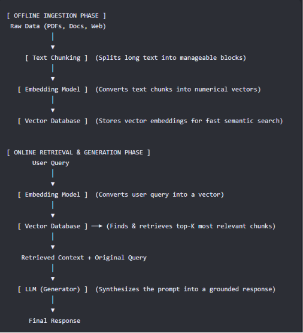

Embeddings are numerical representations of text, images, or other data converted into vectors  numbers . They capture the meaning and relationships between pieces of information. Embeddings that are close together because they express similar ideas. Embeddings allow computers to compare meaning rather than relying only on exact keyword matches.

Cosine similarity is used to measure how similar two vectors are by calculating the cosine of the angle between them. It focuses on the direction of the vectors instead of their magnitude. A cosine similarity score closer to 1 indicates that two embeddings are highly related, while a score closer to 0 means they are less similar. This method is efficient and effective for semantic search tasks.

A vector database stores embeddings along with references to the original data. Instead of storing only text documents, it organizes vector representations so that similar items can be retrieved quickly using similar search. Popular vector databases enable fast searching even when millions of vectors are stored.

The five steps of Retrieval-Augmented Generation (RAG) are:

1. Convert documents into embeddings.
2. Store those embeddings in a vector database.
3. Convert the user's query into an embedding.
4. Retrieve the most relevant documents using similarity search, often with cosine       
   similarity.
5. Provide the retrieved context to a language model to generate the final answer.

RAG is better than simple prompting when answers depend on external or frequently changing information. For example, an employee uploads a document chatbot can retrieve the latest company policies from an internal knowledge base before generating a response. A normal prompt relies only on the model's existing knowledge, which may be  incomplete, whereas RAG grounds the answer with the current information.
